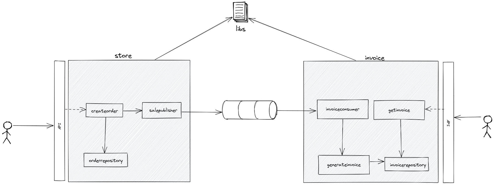

# Node Microservices

> Monorepo de exemplo de abrodagem para microserviços utulizando mensageria.

O repositório possui 3 projetos, e mostra uma abordagem simples para trabalho com microserviços utilizando mensageria (RabbiMQ).
Temos um projeto core, com as classes utilizados pelo microserviços e dois serviços seperadaos. Onde um registra um pedido (store) e o outro processa gerando faturas (invoice).

---


## Technologies

Este projeto utilizou as seguintes tecnologias:

* NodeJs;
* Typescript;
* RabbitMQ;

## Arquitetura



---

## Instalacão

Para executar o projeto deve-se ter instalado o Docker e DockerCompose.

Linux

```sh
./init.sh
```

---

## Development setup

Describe how to install all development dependencies and consider do this for multiple platforms.  

```sh
make install
npm test
```

## Endpoints

### /api/orders

Porta 3040

Criar um pedido:
Método **POST**.

Request - dados do pedido
```javascript
{
	"product" : "Vanilla Ice Cream",
	"quantity" : "2"
}
```

Response
```javascript
{
	id: "121231asderf2333$"
}
```

### api/invoices

Porta 3030

Buscar faturas (invoice)
Método **GET**.

Response
```javascript
{
    "invoices": [
        {
            "orderCode": "561a0c0c-de4a-4e40-96d3-fccb8764c446",
            "dtCreated": "2021-12-15T13:48:07.212Z",
            "quantity": "2",
            "total": 3.98
        }
    ]
}
```

[version-image]: https://img.shields.io/badge/Version-1.0.0-brightgreen?style=for-the-badge&logo=appveyor
[Backend-image]: https://img.shields.io/badge/Backend-Java%208-important?style=for-the-badge
[Backend-url]: https://img.shields.io/badge/Backend-Java%208-important?style=for-the-badge